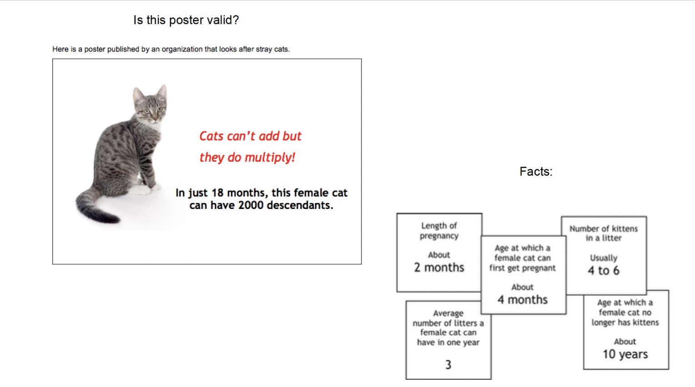

# Kittens

Math poster project, by William Tan (Mr. Thiessen's class)

Hypothesis: In just 18 months, this female cat can have 2000 descendants.



### ANSWER: 2016 descendants; hence true!

## Assumptions
Before we can make calculations, we need to set some assumptions that may not have been clear in the poster.
- First cat is already an adult so can instanly be pregnant
- Cats can become instantly pregnant after they give birth
- Cats can have pregnancies consecutively for 6 months but must wait 6 more months to become pregnant again (to maximize population)

## Usage
```bash
python3 kittens.py 18
```

### Prerequisites
- [Python Installation](https://www.python.org/downloads/)

## Method
We need to take into account that each cat must wait 4 months to be an adult, be pregnant every 2 months but can only have 3 pregnancies in a year. But the children those cats have can have more kittens, and those children even more...
From this, we can tell that problem is complex and hard to solve by hand (especially in larger numbers).

However, we can easily calculate this through a computer program. Let's start:

**1**
All we need to do is start by simulating the life of *one* cat and calculate the amount of babies it has (let's first ignore the babies that cat has). We'll keep track of the number of months that pass by with the variable `t` and the number of babies a cat have with `sum`

```python
""" SIMULATION OF THE OG CAT """

# setting our variables t and sum
t = 18
children = 1 # we start with one, this'll be important later on

t -= 4 # it'll take 4 months until the cat can start having babies

# we're going to continuously loop until the cat has no more months to have babies!
while true:
    t -= LENGTH_OF_PREGNANCY

    if t <= 0:
        # keep having babies!
        children += CATS_PER_LITTER # have a pregnancy and add a whole litter of cats
    else:
        # we've ran out of months to have babies!
        break
```

**2**
But now, what if those cat's have more babies? Somehow we need a way to recursive make new kittens and calculate their babies and their babies' babies! The best way to do this is a function!

```python

""" Recursive function method """

# we can rewrite the last code like this

def cat(t):
    children = 1

    t -= 4
    while true:
        t -= LENGTH_OF_PREGNANCY

        if t <= 0:
            # instead of just adding a whole litter, we need to simulate the babies the next cat has!
            children += cat(t) * CATS_PER_LITTER 
            # so just by using cat(t), we're literally SPAWNING a new cat in!
        else:
            # we've ran out of months to have babies!
            break

    return children
    
```
But what will happen when we, let's say, call cat(2) or cat(0)? Those cats won't have any babies! Luckily, we initially set `children` to `1`, which means that it will instantly break out of the loop and return one, itself! Keep in mind that when we're finding ONLY the descendants a cat has, we're going to have to subtract `1` from the answer.

This function should work properly. Give it a try!

**3**
Adding more complexities and small details, like the avg number of pregnancies in a year, you've successfully created a program to calculate the number of descendants a cat has. Congrats! 

Take a look at kittens.py and try to run it with your own input! See what happens when you try to input large numbers (might freeze your computer!!!)

